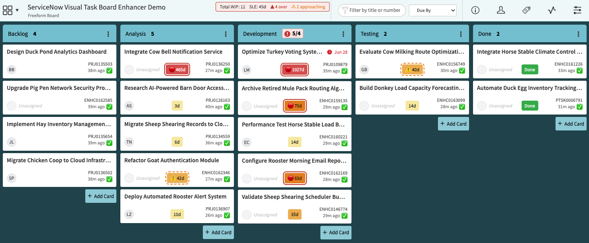
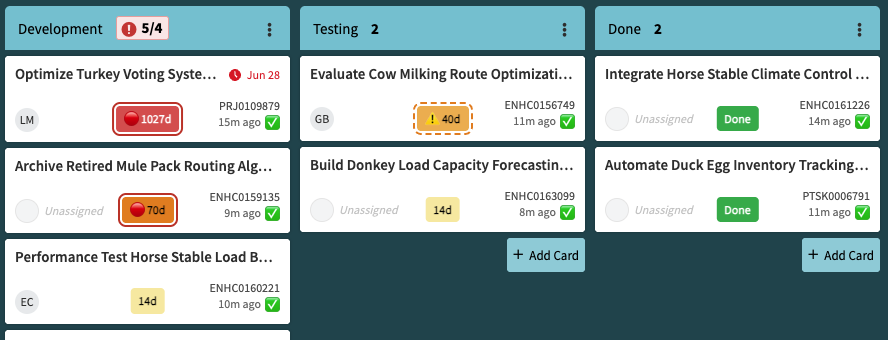
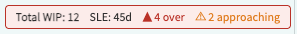
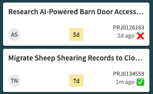
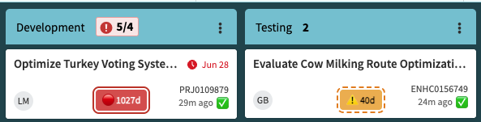
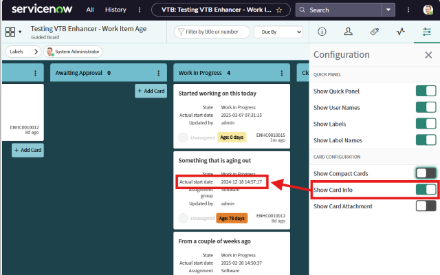

# ServiceNow Visual Task Board Enhancer

A Microsoft Edge extension (also compatible with Chrome) that adds four flow-metric features to ServiceNow Visual Task Boards: work item age badges, total work in progress tracking, last-updated freshness indicators, and service level expectation target monitoring.

---

## Features

- [Work Item Age Badges](#1-work-item-age-badges)
- [Total Work in Progress](#2-total-work-in-progress)
- [Last Updated Freshness Indicators](#3-last-updated-freshness-indicators)
- [Service Level Expectation (SLE) Target](#4-service-level-expectation-sle-target)

All four features are independently toggleable, configured per board through the extension options page, and fall back to global defaults when no board-specific override is set.

---

### 1. Work Item Age Badges

Adds a color-coded badge to the bottom of every card showing how many days the work item has been in progress.

**How age is determined**

The extension looks for date fields on each card in priority order:

1. **Actual Start Date** — preferred. Records when work truly began. Teams can set this independently of when the record was created.
2. **Start Date** — used if Actual Start Date is absent. Treated as the same starting point.
3. **Opened** — fallback. Represents when the record was created, which may predate actual work starting.

**Default color bands**

| Age | Color |
|---|---|
| Under 7 days | Light yellow |
| 7–30 days | Moderate orange |
| 31–90 days | Strong orange |
| Over 90 days | Red |

Cards in a completion state (Resolved, Closed, Done, Fulfilled, etc.) always show a green **Done** badge regardless of age.

Cards with a future start date show a **Starts in Xd** badge in grey.

**Configuration options**

- Fully customizable age bands (day thresholds and colors)
- Optional custom prefix before the day count (e.g. `Age: 10d` or `WIA: 10d`)

---

### 2. Total Work in Progress

Displays the grand total number of cards across your designated WIP lanes in a summary bar near the board title.

ServiceNow already shows a per-lane card count at the top of each lane column. What it does not show is a combined total across the lanes that represent active work in progress — that is a user-defined concept depending on how your board is organized. This feature lets you designate which lanes are WIP lanes, then surfaces the total as a Kanban flow metric.

**Configuration options**

- Enabled per board; not applicable to the Default (All Boards) configuration
- Lane selection with dynamic **Start** / **Finish** markers that group consecutive WIP lanes visually in the options page

---

### 3. Last Updated Freshness Indicators

Adds a fresh or stale emoji next to the last-updated timestamp on each card, making it easy to spot cards that haven't been touched recently.

**Configuration options**

- **Freshness threshold** (days): cards updated within this window show the fresh emoji; older cards show the stale emoji. Default: 6 days.
- **Custom emoji**: choose any emoji for the fresh and stale states (defaults: ✅ / ❌)
- **Lane restriction**: optionally limit freshness indicators to specific lanes only — useful when you only care about freshness in active work lanes and want to ignore backlog or done lanes

---

### 4. Service Level Expectation (SLE) Target

Sets a maximum age target in days per board. Cards approaching or breaching the target are highlighted on their age badge and counted in the summary bar near the board title.

**Configuration options**

- **SLE target (days)**: cards older than this are considered over SLE. Set to 0 to disable.
- **Approaching warning (days before target)**: how many days before the target to start showing a warning. Default: 3 days.
- **Summary bar**: shows over/approaching counts next to the board name. Shares the bar with Total WIP when both features are active.
- **Status emojis**: a configurable emoji is prepended to the age badge as cards approach (default ⚠️) or breach (default 🔴) the target.
- **Colored border**: adds a dashed orange border as cards approach the target and a solid red border when breached.

The summary bar, status emojis, and colored border are each independently toggleable.

---

## Requirements

### Work Item Age Badges

For age badges to show meaningful values, your ServiceNow instance should meet the following:

1. **Include the Actual Start Date field in the VTB form view** for the task types you want to track. The field does not need to be visible on the card face, but it must be part of the VTB form view so its data is available to the extension. If unavailable, the extension falls back to Start Date, then Opened.

2. **Populate Actual Start Date through automation or workflow.** ServiceNow can set this automatically when a task transitions to an active state (e.g. In Progress). Without automation, the extension falls back to Start Date or Opened, which may not accurately reflect when work began.

> **Tip:** Enable **Show Card Info** in the Visual Task Board settings to make date fields visible on cards and confirm the extension is reading the right values.

---

## Installation

### From the Microsoft Edge Add-ons Store (recommended)

1. Visit the [Microsoft Edge Add-ons Store listing](https://microsoftedge.microsoft.com/addons/detail/servicenow-visual-task-bo/jmhhlihdkbdeemfdmehanpkbfkkahpdd).
2. Click **Get** and follow the on-screen instructions.

### Manual installation (development mode)

1. Download or clone this repository.
2. Open Microsoft Edge and go to `edge://extensions/`.
3. Enable **Developer Mode**.
4. Click **Load unpacked** and select the repository folder.

---

## Configuration

Open the extension options by clicking the extension icon in the Edge toolbar and selecting **Options** (or right-clicking the icon and choosing **Extension options**).

**Default (All Boards)** settings apply to every board you visit unless a board-specific override is saved. Work Item Age Badges and Last Updated Freshness Indicators can be configured at the default level. Total Work in Progress and SLE Target are board-specific only — they require knowledge of a board's lanes and purpose.

**Board-specific settings** become available after you visit a board at least once; the extension automatically discovers the board's name and lane structure. Select the board from the dropdown to configure it independently.

Changes take effect the next time you load a VTB page.

---

## Troubleshooting

### Age badges not appearing

- Confirm that at least one of **Actual Start Date**, **Start Date**, or **Opened** is included in the VTB form view and populated on the card.
- Enable **Show Card Info** in the VTB settings to expose card fields.
- Reload the page or reload the extension from `edge://extensions/`.

### Age count seems incorrect

- Verify the date field is correctly formatted and populated.
- Check whether ServiceNow customizations or security restrictions are hiding field data from the browser.

### Total WIP shows 0

- Ensure the feature is enabled for the board and at least one WIP lane is selected in the options.
- Visit the board once after saving options so the extension can read ServiceNow's lane counts.

### SLE or freshness indicators not showing

- Confirm the feature is toggled on for the board in options and saved.
- For SLE, verify the target days value is greater than 0.
- For freshness indicators, check that the correct threshold is set and — if lane restriction is on — that the relevant lanes are checked.

### Extension does not load

- Confirm the extension is enabled in `edge://extensions/`.
- Check the browser console (`F12` → **Console**) for errors.
- The extension only runs on URLs matching `*://*.service-now.com/*vtb.do*`.

---

## Contributing

Pull requests and issue reports are welcome. Please open an issue before submitting a substantial change so the approach can be discussed first.

---

## License

This project is licensed under the **GNU General Public License v3.0**. See the [LICENSE](LICENSE) file for details.
